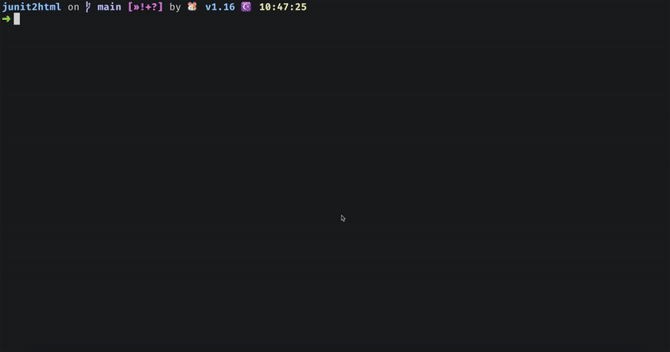

# junit2html

## Install

```bash
go install github.com/u2takey/junit2html@latest
```


## Usage

```bash
# usage1: convert junit test xml to html
./junit2html ./test.xml ./output/report.html


# usage2: convert go test output to html
go test -v ./... | ./junit2html ./output/index.html --open
```


## Demo





## Refer 
- [go-junit-report](https://github.com/jstemmer/go-junit-report)
- [junit2html](https://github.com/inorton/junit2html)